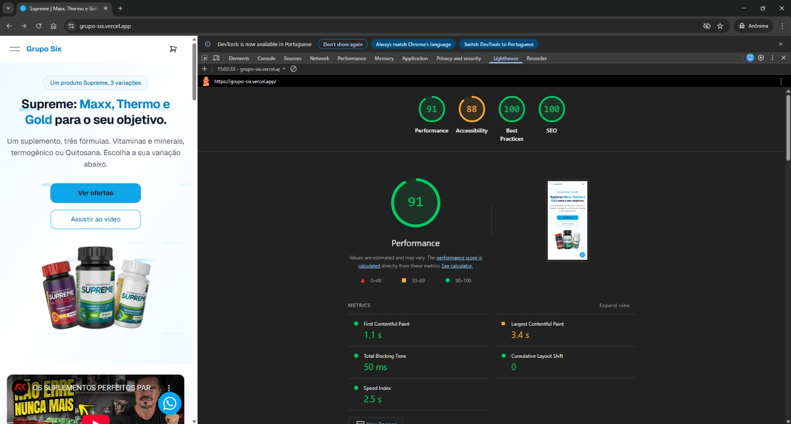

# Documentação – Teste para Desenvolvedor Front-end React 2026

Página VSL para Marketing Digital – Projeto Six Group

---

## Requisitos Técnicos (PDF)

| Requisito | Atendido | Onde / Observação |
|-----------|----------|-------------------|
| **Framework:** React com Vite (Next.js diferencial) | ✅ Next.js | Next.js 16, App Router |
| **Estilização:** Tailwind CSS | ✅ | Tailwind v4 |
| **Deploy:** Vercel | ✅| URL: <https://grupo-six.vercel.app/> |
| **Performance:** Lighthouse para métricas | ✅ | Score ≥80 em Performance, Acessibilidade, Boas Práticas e SEO (preencher seção Métricas) |
| **UTMs:** Captura e preservação de parâmetros UTM | ✅ | `src/lib/utm.ts`; ver seção Gerenciamento de UTMs |
| **UTMs:** Repasse VSL → Checkout → Obrigado | ✅ | Landing, checkout, obrigado; query no redirect |
| **Responsividade:** Layout mobile-first | ✅ | Breakpoints Tailwind, layout adaptativo em todas as páginas |
| **Performance:** Otimização de imagens e vídeo | ✅ | `next/image` com `sizes`; vídeo YouTube embed responsivo |
| **Lighthouse:** Score mínimo 80 (Perf, Acess, BP, SEO) | ✅ | Seção de Métricas |

---

## Estrutura da Página VSL (PDF)

### 1. Headline Principal

- **Requisito:** Frase com até 16 palavras.
- **Implementado:** Sim.
- **Onde:** `HeroSection` – texto: "Supreme: Maxx, Thermo e Gold para o seu objetivo." (9 palavras).
- **Arquivo:** `src/components/landing/HeroSection.tsx`

### 2. Player de Vídeo

- **Requisito:** Player responsivo (ex.: YouTube); controles acessíveis (volume, play/pause).
- **Implementado:** Sim.
- **Onde:** Embed YouTube com controles nativos; player responsivo; fallback com botões e `aria-label`.
- **Arquivo:** `src/components/landing/VideoPlayer.tsx`

### 3. Seção de Produtos

- **Requisito:** Apresentação clara dos produtos; CTAs estratégicos; preços e condições de pagamento.
- **Implementado:** Sim.
- **Onde:** Cards por produto, CTAs "Quero o…", preço, parcelamento, "Cartão, PIX ou boleto".
- **Arquivo:** `src/components/landing/ProductsSection.tsx`

### 4. Seção de Testemunhas

- **Requisito:** Depoimentos demonstrativos; imagens e texto.
- **Implementado:** Sim.
- **Onde:** Avatares (DiceBear API), nome, função, texto dos depoimentos.
- **Arquivo:** `src/components/landing/TestimonialsSection.tsx`

### 5. Footer com Disclaimer

- **Requisito:** Texto legal demonstrativo; links de política de privacidade e termos de uso.
- **Implementado:** Sim.
- **Onde:** Disclaimer no rodapé; links `/politica-de-privacidade` e `/termos-de-uso`.
- **Arquivo:** `src/components/landing/Footer.tsx`

### 6. Página de Obrigado

- **Requisito:** Indicar a compra do usuário; captura e preservação de parâmetros UTM.
- **Implementado:** Sim.
- **Onde:** Título "Obrigado pela sua compra", mensagem de confirmação; bloco "Parâmetros UTM preservados" na página.
- **Arquivos:** `src/components/obrigado/ObrigadoClient.tsx`, `src/app/obrigado/page.tsx`

---

## Entrega do Projeto (PDF)

### 1. Código-fonte

- **Repositório no GitHub:** <https://github.com/PedroHenrique1606/six-group>
- **Documentação de como executar localmente:** Ver seção "Como executar localmente" abaixo.

### 2. Versão em Produção

- **Deploy:** Vercel (gratuito).
- **URL funcional:** <https://grupo-six.vercel.app>

### 3. Documentação

- **Decisões técnicas:** Seção "Decisões técnicas" abaixo.
- **Estratégias de otimização:** Seção "Estratégias de otimização" abaixo.
- **Métricas do Lighthouse (screenshots):** Seção "Métricas do Lighthouse" abaixo.

---

## Como executar localmente

1. Clone o repositório: `git clone https://github.com/PedroHenrique1606/six-group`
2. Entre na pasta: `cd six-group`
3. Instale as dependências: `npm install` ou `npm i`
4. Rode em desenvolvimento: `npm run dev`
5. Acesse: [http://localhost:3000](http://localhost:3000)

Para build de produção: `npm run build && npm run start`

---

## Decisões técnicas

- **Next.js 16 (App Router):** Rotas aninhadas, layouts compartilhados, SSR/SSG. Páginas estáticas no build; produto com `generateStaticParams` (maxx, thermo, gold).
- **TypeScript:** Tipagem em todo o projeto (produtos, UTMs, CEP, carrinho).
- **Tailwind v4:** Estilização utilitária, design tokens em `globals.css`, breakpoints `sm`, `md`, `lg`.
- **Hero UI (componentes):** Escolhido para acelerar o desenvolvimento com componentes prontos, acessíveis e bem integrados ao Tailwind. Garante consistência visual, suporte a ARIA, navegação por teclado e estados de foco, reduzindo retrabalho em acessibilidade e UI base.
- **Hero Icons (ícones):** Biblioteca adotada por ser leve, consistente visualmente e pensada para uso direto com React + Tailwind. Permite controle total via classes utilitárias (size, cor, hover, dark mode) sem dependência de SVGs externos ou libs pesadas.
- **Framer Motion:** Animações (seções, drawer, overlay, página de obrigado) com `AnimatePresence`.
- **Axios:** ViaCEP em `lib/cep.ts` com timeout e tratamento de erro.
- **Estrutura:** Pastas por feature (`landing/`, `produto/`, `checkout/`, `cart/`, `obrigado/`); libs em `lib/`; contexto de carrinho em `context/CartContext.tsx` e `app/providers.tsx`.

---

## Estratégias de otimização

- **Imagens:** `next/image` com `sizes`; LCP com `priority`; fallback em `ProductImageFallback`.
- **Fontes:** `next/font` (Geist) com `display: "swap"`.
- **Preconnect:** `layout.tsx` – preconnect para YouTube e api.dicebear.com.
- **Rotas:** Estáticas onde possível; produto em SSG.
- **Carrinho:** `localStorage` após hidratação para evitar mismatch.
- **Frete:** ViaCEP no cliente, timeout 8s, valor simulado em `lib/cep.ts`.
- **Acessibilidade e SEO:** `<main id="main-content">`, headings em ordem, `aria-label` em ícones, headers de segurança em `next.config.ts`.
- **Responsividade:** Grid/flex com breakpoints; navbar e checkout adaptativos.

---

## Gerenciamento de UTMs

- **Landing:** UTMs da URL gravados em `sessionStorage` (`getUtmFromSearch`, `saveUtmToStorage`).
- **Produto:** Captura UTMs da URL ao carregar e persiste no storage.
- **Links internos:** Links para produtos anexam `utmQueryString` (hook/helper) para manter UTMs.
- **Checkout:** Ao finalizar, `loadUtmFromStorage()` monta a query e redireciona para `/obrigado?utm_source=...&...`.
- **Obrigado:** Lê UTMs da URL e do storage (`mergeUtmFromUrlAndStorage`), exibe no bloco "Parâmetros UTM preservados".
- **Chaves:** `utm_source`, `utm_medium`, `utm_campaign`, `utm_term`, `utm_content` em `src/lib/utm.ts`.

**Como testar:** Abra a landing com UTMs na URL (ex.: `?utm_source=facebook&utm_medium=cpc&utm_campaign=teste`), navegue até um produto, vá ao checkout e finalize; na página de obrigado o bloco deve listar os UTMs.

---

## Métricas do Lighthouse (screenshots)

**Como gerar:** Build de produção (`npm run build && npm run start`), abra a URL no Chrome → DevTools → Lighthouse → selecione Performance, Accessibility, Best Practices, SEO → Desktop e/ou Mobile → Analyze.

**Screenshots (em `docs/lighthouse/`):**

| Categoria       | Desktop | Mobile |
|-----------------|---------|--------|
| Performance     |  |  |
| Accessibility   |  |  |
| Best Practices  |  |  |
| SEO             |  |  |

**Scores obtidos** (Lighthouse em produção – grupo-six.vercel.app):

| Categoria       | Desktop (0–100) | Mobile (0–100) |
|-----------------|-----------------|----------------|
| Performance     | 99 | 91 |
| Accessibility   | 88 | 88 |
| Best Practices  | 100 | 100 |
| SEO             | 100 | 100 |

**Métricas de Performance (mobile)** – FCP 1,1 s, LCP 3,4 s, TBT 50 ms, CLS 0, Speed Index 2,5 s (conforme screenshot performance-mobile.jpg).

---

## Critérios de avaliação – como o projeto atende (PDF)

| Critério | Atendimento |
|----------|-------------|
| **Qualidade do código:** organização, legibilidade, reutilização | Pastas por domínio; nomes claros; reutilização de `formatPrice`, `getProductBySlug`, `fetchCep`, hooks `useCart`/`useUtm`, componentes compartilhados. |
| **Performance:** tempo de carregamento, otimizações | Next.js estático/SSG; `next/image` e `sizes`; bundle com Turbopack; carrinho sem bloquear primeira renderização. |
| **Responsividade:** adaptação a diferentes dispositivos | Grid/flex e breakpoints Tailwind; navbar com menu mobile; checkout em coluna no mobile; drawer e botões responsivos. |
| **Gerenciamento de UTMs:** implementação correta | Captura na landing e produto, persistência em sessionStorage, repasse em links e no redirect para obrigado, exibição na página de obrigado (seção acima). |
| **Atenção aos detalhes:** requisitos e produto completo | Itens 1–6 da estrutura VSL atendidos; fluxo landing → produto → carrinho → checkout → obrigado com UTMs preservados. |

---
